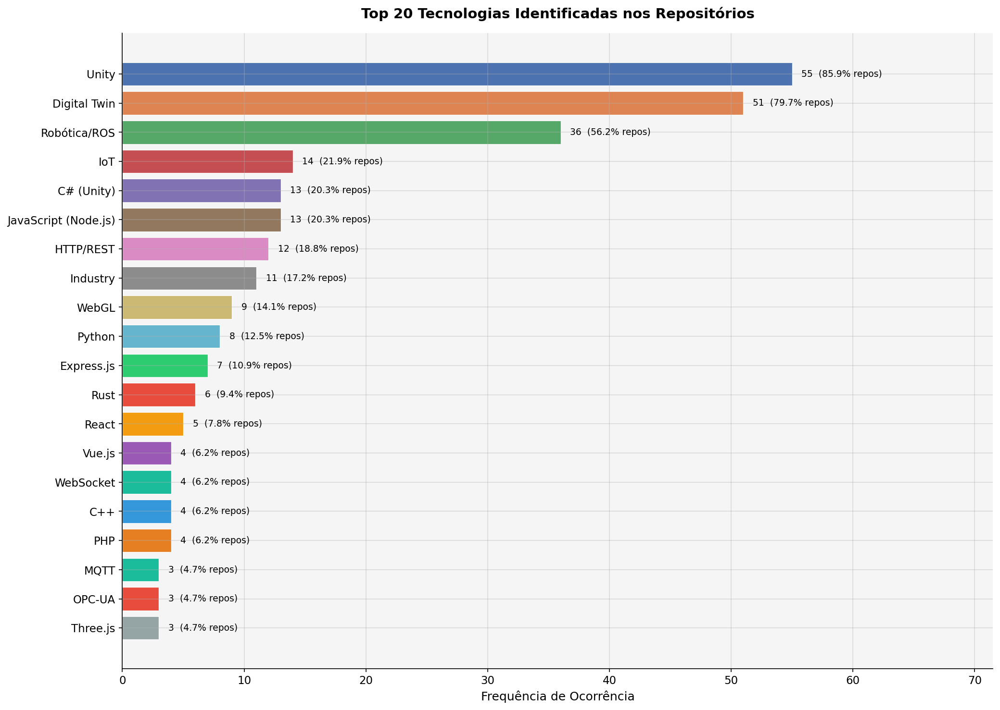
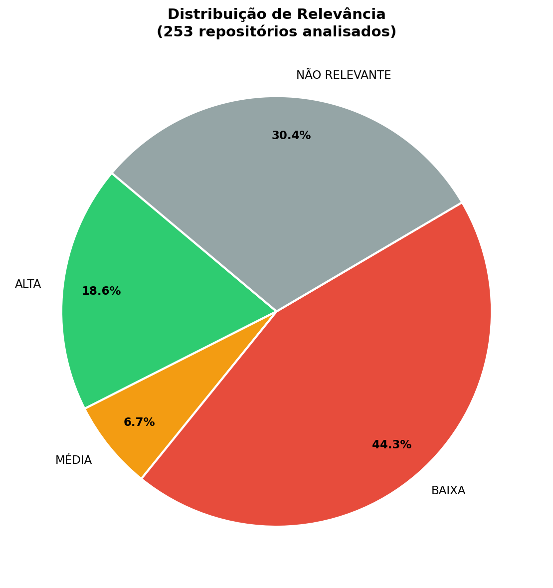
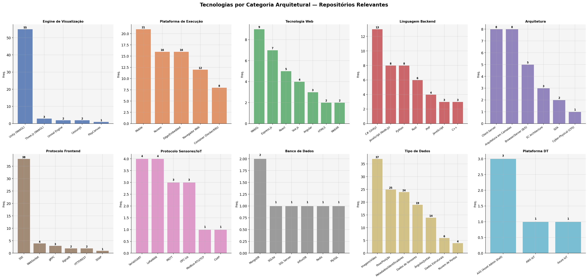
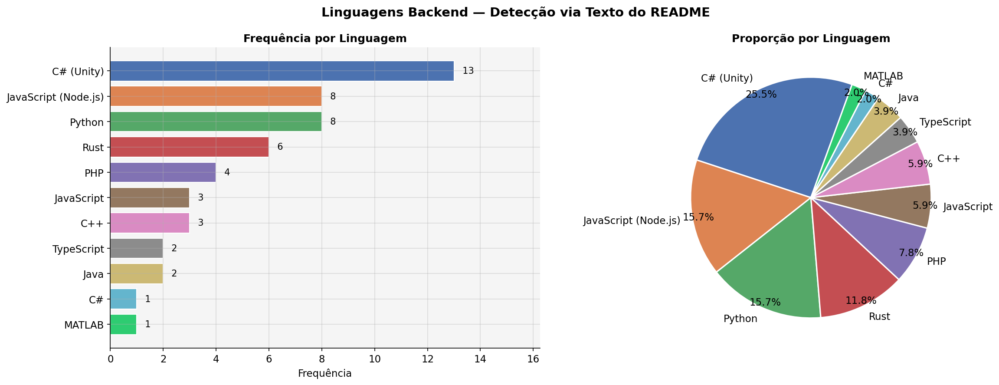
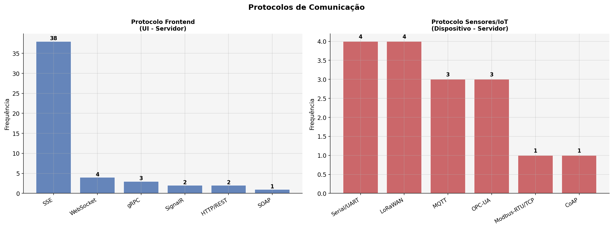
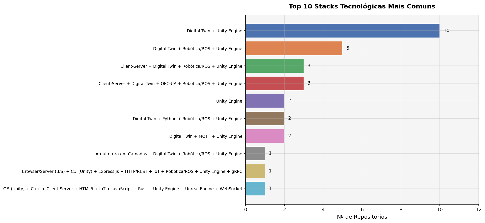
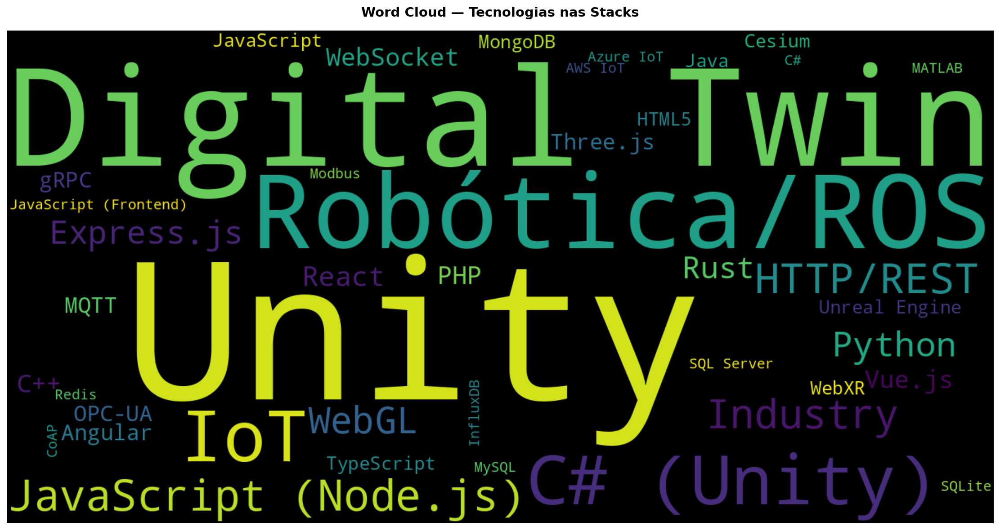

# Digital Twin Web Technology Survey 

> Levantamento tecnológico sobre gêmeos digitais com visualização web. Essa pesquisa foi iniciada em fevereiro de 2026 e apresenta resultados iniciais para stack tecnologica de gemeos digitais na web com a engine Unity. 

---

## Descrição

Este repositório documenta o pipeline completo de pesquisa aplicada conduzido para orientar as decisões técnicas de stack do projeto de gêmeo digital. A pesquisa combina revisão sistemática de artigos científicos (IEEE Xplore + ASReview), análise de repositórios GitHub via API, e extração estruturada de informações com NotebookLM com base em um roteiro de perguntas.

O foco central é responder: quais tecnologias são utilizadas em implementações de gêmeos digitais com visualização web utilizando Unity engine e como essas escolhas impactam a viabilidade de integração com dados de sensores em tempo real?
Qual a stack tecnologica mais utilizada em projetos de gemeo digital na web com unity? 

---

## Estrutura do Repositório

```
digital-twin-web-tech-survey/
│
├── README.md
├── dados/
│   ├── repositorios_analisados/
│       └──extracao_repositorios.xlsx
|   ├── artigos_analisados/
|       └──artigos_aproveitados/
|       └──artigos_descartados/
|       └──artigos_coletados.xlsx
|       └──artigos_selecionados.csv
│
├── notebooks/
│   └── pesquisa_dt_p2_v2.ipynb    
│
├── pipeline/
│   └── dossie_gemeos_digitais.docx
│   └── pipeline_pesquisa_gemeo_digital.docx     
│
├── resultados/
│   └── dossie_resultados_gemeo_digital.docx	
│   └── top_50_repositorios_relevantes.xlsx
│   └── gemeos_digitais_normas_ISO.md		
│   └── tabela_comparativa_extracao_notebookLM.xlsx
|   └── visualizacoes/
|        ├── viz_01_top20_tecnologias.png
|        ├── viz_02_relevancia.png
|        ├── viz_03_categorias_expandidas.png
|        ├── viz_04_linguagens_backend.png
|        ├── viz_05_protocolos.png
|        ├── viz_06_stacks.png
|        |── viz_08_wordcloud.png
```

---

## Metodologia

A pesquisa combina três categorias de fontes:

**1. Artigos Científicos**  
250 artigos exportados do IEEE Xplore. Triagem via ASReview (active learning sobre abstracts): 74 analisados, 31 aceitos. Extração de informações padronizada via NotebookLM com roteiro de 10 perguntas por artigo.

**2. Repositórios GitHub**  
Coleta via GitHub API com termos relacionados a *digital twin*, Unity WebGL e IoT. Análise de READMEs com extração de termos técnicos por categoria (linguagens, frameworks, protocolos, bancos de dados, arquiteturas). Normalização via TF-IDF. Total: 253 repositórios analisados.

**3. Normas e Fontes Industriais**  
ISO 16739-1:2024 (IFC/BIM para infraestrutura crítica), Eclipse Foundation IoT Survey, documentação Azure Digital Twins, FIWARE, Asset Administration Shell (IDTA).

---

## Principais Resultados

### Top 20 Tecnologias nos Repositórios



Unity domina com 85,9% dos repositórios relevantes. Digital Twin aparece em 79,7%. A stack mais comum é **Digital Twin + Unity Engine** (10 repositórios), seguida por variações com Robótica/ROS e OPC-UA.

---

### Distribuição de Relevância (253 repositórios)



| Relevância | % |
|---|---|
| Alta | 18,6% |
| Média | 6,7% |
| Baixa | 44,3% |
| Não relevante | 30,4% |

---

### Tecnologias por Categoria Arquitetural



Destaques por categoria:
- **Engine de Visualização:** Unity WebGL (55 ocorrências), Three.js (3), Unreal Engine (2)
- **Plataforma de Execução:** Mobile (21), Nuvem (16), Edge/Embedded (16), Navegador Web (12)
- **Tecnologia Web:** WebGL (9), Express.js (7), React (5)
- **Linguagem Backend:** C# Unity (13), JavaScript Node.js (8), Python (8), Rust (6)
- **Arquitetura:** Client-Server (8), Arquitetura em Camadas (8), Browser/Server B/S (5)
- **Protocolo Frontend:** SSE (38), WebSocket (4), gRPC (3)
- **Protocolo Sensores/IoT:** Serial/UART (4), LoRaWAN (4), MQTT (3), OPC-UA (3)
- **Banco de Dados:** MongoDB (2), SQLite (1), SQL Server (1), InfluxDB (1)
- **Plataforma DT:** AAS/Asset Admin Shell (3), AWS IoT (1), Azure IoT (1)

---

### Linguagens Backend



C# (Unity) lidera com 25,5%, seguido por JavaScript (Node.js) e Python com 15,7% cada. Rust aparece com 11,8% — relevante para contextos de alta performance e sistemas embarcados.

---

### Protocolos de Comunicação



- **Frontend (UI → Servidor):** SSE é amplamente dominante (38 ocorrências). WebSocket aparece em segundo (4), seguido de gRPC (3) e SignalR (2).
- **Sensores/IoT (Dispositivo → Servidor):** Serial/UART e LoRaWAN empatados (4 cada). MQTT e OPC-UA com 3 cada — ambos relevantes para contextos industriais.

---

### Top 10 Stacks Mais Comuns



A stack **Digital Twin + Unity Engine** é a mais frequente (10 repositórios). Variações com Robótica/ROS, OPC-UA e arquitetura Client-Server completam o top 5.

---

### Word Cloud — Tecnologias nas Stacks



---

## Extração via NotebookLM — Artigos Científicos

Síntese dos 8 artigos extraídos na tabela comparativa:

| Artigo | Engine | Backend | Protocolo Frontend | Protocolo Sensores | Banco de Dados | Arquitetura |
|---|---|---|---|---|---|---|
| Truss Gantry Crane | Three.js | Node.js | WebSocket | Modbus-RTU | — | B/S 6 camadas |
| Robot Arm Control | Three.js | — | WebSocket | Wi-Fi (ESP32) | — | Ciber-Físico |
| Vertical Farming | Unity WebGL | Node.js / Python | WebSocket | MQTT, CoAP | SQLite | 3 partes |
| DTaaS Industry 4.0 | Vuforia (XR) | — | HTTP/REST | IoT | Nuvem | 5 camadas RAMI |
| Thermal Power Plant | Própria | C++ / MATLAB | HTTP | TCP | Cloud DB | 4 camadas |
| Twinbase Open-Source | Web Estática | YAML/JSON | HTTPS | — | Git | GADIT |
| Assembly Line Sustainability | Unity WebGL | Node.js / C# | Socket.IO | OPC-UA | SQL Server | CPS |
| Assembly Lines ICPS | Unity WebGL | Node.js / C# | Socket.IO | OPC-UA / Ethernet IP | SQL | 5C / 6 camadas |

---

## Normas Aplicáveis — Infraestrutura Crítica

Para infraestruturas como vertedouros, a norma **ISO 16739-1:2024** (IFC) é a referência técnica principal. Ela foi expandida para cobrir explicitamente infraestruturas críticas como pontes, barragens, hidrovias e instalações portuárias.

A recomendação técnica consolidada é utilizar o esquema IFC para modelagem BIM, integrando dados de sensores (IoT) em uma plataforma aberta e interoperável — compatível com a visão de Fase 2 (dados em tempo real) do projeto.

Referência completa: `data/gemeos_digitais_normas_ISO.md`

---

## Perguntas de Pesquisa

A pesquisa foi estruturada em seis blocos temáticos:

1. Visualização Web com Unity (WebGL, WebAssembly, streaming)
2. Arquitetura de Software (monolito, microsserviços, event-driven)
3. Backend e Linguagens (frequência e adequação a séries temporais)
4. Protocolos de Comunicação (histórico vs. tempo real)
5. Dados e Persistência (séries temporais, APIs)
6. Mercado e Maturidade (plataformas consolidadas vs. emergentes)

Roteiro completo de perguntas para extração com NotebookLM disponível em `pipeline_pesquisa_gemeo_digital.docx`.

---

## Alertas Metodológicos

- **Viés do ASReview:** O modelo prioriza artigos similares aos aceitos. Recomenda-se amostrar 20 artigos aleatórios dos 176 não analisados para verificar cobertura.
- **Viés do dicionário de termos:** Tecnologias não listadas são invisíveis na análise de READMEs. O dicionário foi construído de forma indutiva a partir de n-gramas.
- **Artigos vs. Repositórios:** Artigos descrevem propostas em laboratório; repositórios descrevem implementações reais. A interseção entre as duas fontes representa o núcleo de maior confiabilidade.
- **Contexto de infraestrutura crítica:** Barragens exigem escolhas tecnológicas mais conservadoras, com maior ênfase em confiabilidade e rastreabilidade.

---

## Contexto do Projeto

**Objetivo:** Gêmeo digital de infrestrutura crítica utilizando unity engine para visualização
**Fase 1:** Dados históricos estáticos  
**Fase 2 (futura):** Ingestão de dados de sensores em tempo real  

---

*Este repositório foi utilizado como um entregável de pesquisa aplicada e análise de dados. O conteúdo representa um panorama tecnológico para suporte à tomada de decisão técnica da equipe, não constitui recomendação definitiva de stack.*
